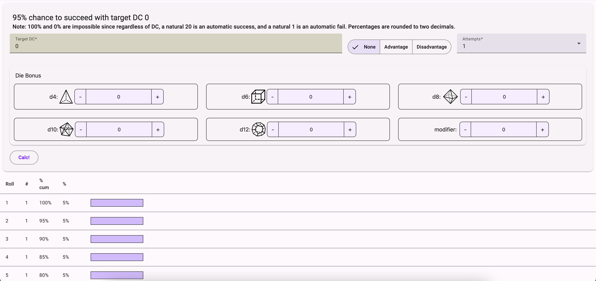
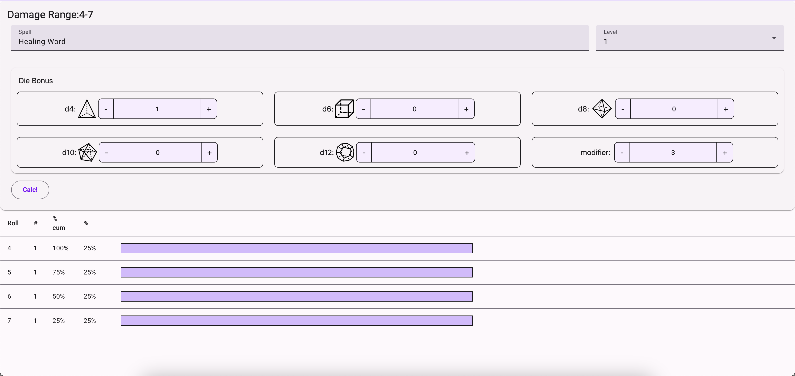
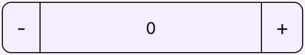
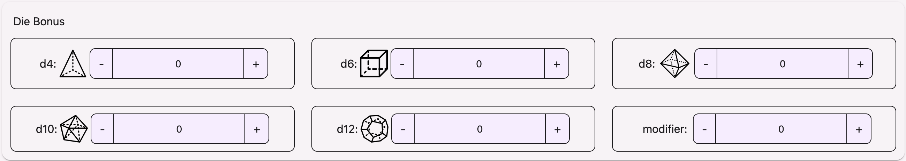
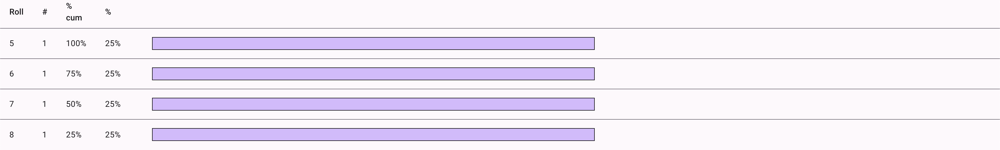

# Dice Calculator

Webpage found here: <https://test-00-c77de.web.app/>

This webpage is designed to show all possible values that could result in rolling certain amounts of dice.
This makes it easier to determine what the likelihood of each decision would be when playing dnd,
and properly understand how likely an action is to suceed when you try it in dnd.

## Technologies Used

Angular is used to build website. API calls are made to <https://www.dnd5eapi.co/> to get the list of all spells in dnd.
TailwindCSS and Material are used for styling components, and organizing the layout.
Testing is done with Karma.
Documentation is built with compodoc, and deployed to github pages using github actions. Local testing of github actions was using act by nektos.
Deployment is handled by firebase.

## Pages

### Services

- dice-calculations.service.ts -- This holds all the functions used in dice calculations
- spells.service.ts -- This holds all the functions used to access DnD API to get spell information

### Data Types

- spell.ts -- This holds all the data types used to organize data gotten from API
- diceset.ts -- This holds all the data types used to organize data related to dice rolls
  - Check [skillCheckCalc](https://creativepenguin.github.io/angular-bg-forms/injectables/DiceCalculationsService.html#skillCheckCalc) function on diceset details main algorithm used to calculate dice rolls

### Components

- skill-check.component.ts -- Skill Check Page  
It contains frontend for calculating likelihood of skill check suceeeding.

- attack-rolls.component.ts -- Attack Rolls Page  
It contains frontend for calculating spell damage and likelihood.

- stepper.component.ts -- Dice input  
Modified form input (type="number", but with + and - buttons on the sides)

- dice-bonus-form.component.ts -- Dice Form  
Reusable form subsection that holds dice values that can be added to calculations

- die-roll-results-table.component.ts -- Roll Table  
Reusable form table that is dynamically added to dice calculations pages

### Video Resources Used

- [Deploy to Firebase](https://www.youtube.com/watch?v=UNCggEPZQ0c)
- [Github Pages Deploy](https://www.youtube.com/watch?v=jBZfo2Mj1mY)
- [Custom form component (used in stepper.component.ts)](https://www.youtube.com/watch?v=xTcJQaWiJ2c&list=PLw5h0DiJ-9PDF6TTr0J7HmKK_7t6XTPuN)
- [Reusable angular forms (used in dice-bonus-form.component)](https://www.youtube.com/watch?v=o74WSoJxGPI)
- [Dynamic components (used to implement die-roll-results-table)](https://www.youtube.com/watch?v=ncbftt3NWVo)
